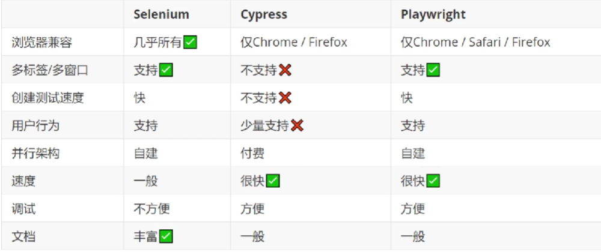

# WEB自动化项目实战训练营

## 一、Web自动化测试需求和挑战

- 属于E2E测试，是软件质量保证的最后一道防线
- 点点点：低调，复杂的场合无法测试
- 好的测试，不仅仅模拟用户行为，还要记录、调试网页细节
- 优势：
  - 提速增效
  - 解放双手
  - 技能提升
- 目前主流的工具
  - Cypress
  - Playwright
  - Selenium



**selenium的优势：**
- 浏览器支持最多，兼容最好
- 支持多种编程语言
- 生态成熟，文档丰富
- 进行App自动化测试，事半功倍

## 二、Selenium自动化环境搭建

一键搭建：  
`pip install webdriver-helper==1.*`(注：1.*版本为免费版本)

webdriver-helper:
- 自动获取浏览器的版本、操作系统类型
- 自动下载浏览器驱动
- 自动创建和返回WebDriver对象


控制浏览器
```python
from webdriver_helper import *

with get_webdriver() as driver:
    driver.get("https://www.baidu.com")
```

## 三、selenium自动化实战

Web自动化测试三板斧：
- 定位元素
- 交互元素
- 进行断言

### 3.1 八大定位策略

```python
from selenium.webdriver.common.by import By
```

由selenium提供的定位策略，共有8个，可以分成三组。

使用定位策略：
1. `driver.find_element_by_id()` # 被弃用
2. `driver.find_element(By.ID, "")` # 推荐
3. 如果要定位多个元素，使用`driver.find_elements(By.ID, "")`

#### 分组1：根据文本定位a标签

- LINK_TEXT 精确定位
- PARTIAL_LINK_TEXT 模糊定位

#### 分组2：根据属性，定位任意元素

- ID
- NAME
- CLASS_NAME
- TAG_NAME

```html
<input 
        id = "search-input"
        type="text" 
        name="wd" 
        class="am-form-field" 
        placeholder="其实搜索很简单^_^ !" 
        value="" autocomplete="off">
```

对于同一个元素，可以使用多种定位策略。

#### 分组3：通用定位策略

- CSS
- XPath

```html
<button type="submit" id="ai-topsearch" class="submit am-btn">
    <i class="am-icon-search"></i>
    <span>搜索</span>
</button>
```

分组2，实际上是通过分组3的CSS完成定位的。
```
el = driver.find_element(By.CSS_SELECTOR, ".submit, am-btn")
```

- css表达的语法不够直观
- 只能用于Web自动化测试

##### XPath

- XPath是一种查询语言
- 支持逻辑运算、函数
- 实现非常强大的功能
- 可以用于App的自动化测试

1. XPath语法  
   表示层级 + 属性
   - / （开头）根路径
     - `/html/body/div`
   - // 任意层级（包括所有层）
     - `//div`
   - @ 属性 
     - `$x('//a[@target="_top"]')` 
   - / （中间）下一层
     - `//p/input`
   - . 本层
   - .. 上一层
     - 相对定位`$x('//input[@placeholder="请输入登录密码"]/../../..//input')[0]`
2. XPath函数
   - text 获取元素内的文本
     - `$x('//a[text()="vivo X5MAX L 移动4G 八核超薄大屏5.5吋双卡手机vivoX5max"]')` 
   - contains 任意位置包含
     -  `$x('//a[contains(text(), "vivo")]')`
   - starts-with 开头
     - `$x('//a[starts-with(text(), "vivo")]')` 

----

### 3.2 实战：商品下单流程

1. 登录
2. 选择商品
3. 创建订单
4. 选择收获地址
5. 选择支付方式
6. 点击 提交订单

### 问题：

- 代码复用性
- sleep等待
- 复杂元素的处理

## 四、引入pytest

安装pytest`pip install pytest`

使用pytest  
约定：测试用例相关的内容，以test开头来命名

筛选用例：`pytest -k 函数名`

## 五、pytest夹具

在测试用例前、后自动执行一些代码。

如果测试用例需要已登录的状态，但是“登录”不是当前的用例测试步骤，将登录前置到夹具中。

1. 定义夹具
   ```python
   import pytest
   from webdriver_helper import get_webdriver
   
   @pytest.fixture()
   def driver():
       driver = get_webdriver()
       return driver
   ```
2. 使用夹具`def 函数名(夹具名)`

**重点1：夹具的前置和后置**

```python
import pytest
from webdriver_helper import get_webdriver

@pytest.fixture()
def driver():
    driver = get_webdriver()
    driver.maximize_window()  # 窗口最大化
    driver.get("http://101.34.221.219:8010/")   # 访问首页
    # 前置部分，在测试用例之前执行
    # 登录代码
    yield driver    # 生成器的写法
    # 后置部分，在测试用例之后执行
    driver.quit()
```

浏览器启动的次数 = 测试用例的个数  
如何避免重复启动浏览器？

**重点2：夹具范围**

pytest夹具有5种范围：

- function：默认，每个用例执行一次
- class：每个类执行一次
- module：每个模块执行一次
- package：每个包执行一次
- session：整个测试过程只执行一次

## 六、解决登录问题

1. 自动登录
2. 不必重复登录

## 七、解决不进行登录的问题

1. 不重启浏览器
2. 保持不登录的状态，以便对登录进行测试

网站的登录状态，是如何保持的？  
cookie

## 八、POM设计模式

pytest解决了用例层面的问题  
pom页面层面的问题，没有解决

> 1.登录（已解决）  
> 2.进入个人中心，点击【新增地址】  
> 3.处理弹窗  
> 4.输入框、下拉选择框（选填、必填）

**Page Object Model:**页面对象设计模式

1. 使用对象代表页面
2. 使用对象的属性代表页面的元素
3. 使用对象的方法代表页面的操作

定义过程：

1. 定义BasePage（抽象类）
2. 定义Page（页面类）
3. 定义元素的交互（对象方法）

使用过程：

1. 打开页面，实例化Page
2. 调用Page方法，完成交互

## 实战

1. 使用POM测试用例非常的清爽
2. 封装了BasePage，元素定位非常的简单
3. 封装Page，相似的交互动作，不用写重复的代码
